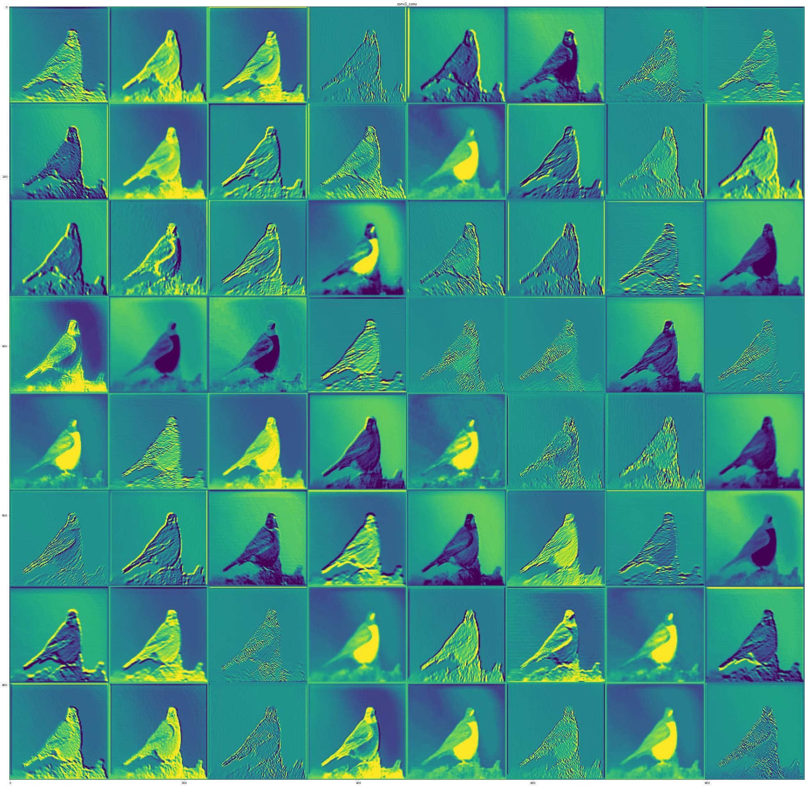

# Project

Analyzing the features extracted by each filter in the ResNet101 model can give us insights into what kind of patterns and details the model is learning to identify in an image. 
\
Here are some general observations that can be made about the features extracted by each layer:

- ## Layer 1 (conv1_pad, conv1_conv):
  In the first layer, the filters seem to be identifying low-level features such as edges and corners. Many of the filters seem to be oriented in different directions, suggesting that the model is learning to detect edges at different angles.
 
  
  
- ## Layer 2 (pool1_pad, pool1_pool):
  In the second layer, the features extracted are a bit more abstract and complex. The filters seem to be identifying simple shapes and patterns, such as curves and corners, and some filters seem to be picking up on texture details such as stripes or dots.
  
  
  
- ## Layer 3 to 6 (conv2_block1_...):
  In these layers, the filters are identifying more complex shapes and patterns such as circles, rectangles, and triangles. Some filters are also picking up on texture details such as spots or stripes. The filters in these layers seem to be focused on detecting objects and their various parts.
  
  
  

- ## Layer 7 to 13 (conv3_block1_...):
  In these layers, the filters continue to detect objects and their various parts but with increasing complexity. Some filters seem to be picking up on patterns in the background of the image, such as trees or buildings. The filters in these layers also seem to be better able to differentiate between similar objects or object parts.
  
  
  

- ## Layer 14 to 23 (conv4_block1_...):
  In these layers, the filters seem to be focusing on detecting more abstract features, such as the overall shape and appearance of objects rather than their individual parts. Some filters seem to be picking up on patterns in the background of the image, such as textures or structures. The filters in these layers also seem to be better able to differentiate between objects with similar appearances.
  
  
  

- ## Layer 24 to 40 (conv5_block1_...):
  In these layers, the filters are detecting even more abstract features, such as the overall context and composition of the image. Some filters seem to be picking up on specific object categories, such as animals or vehicles. The filters in these layers seem to be integrating information from multiple regions of the image to make more holistic judgments about the content of the image.
  
  
  

Overall, the ResNet101 V2 model seems to be using a hierarchical approach to learn features of increasing complexity and abstraction as we move up the layers. The filters in the earlier layers are detecting low-level features such as edges and corners, while the filters in the later layers are detecting high-level features such as the overall composition and context of the image. This approach allows the model to make increasingly sophisticated judgments about the content of the image, and to make accurate predictions about what is in the image.

